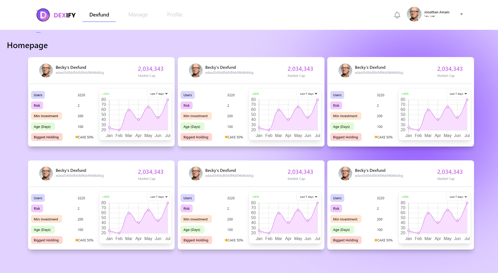
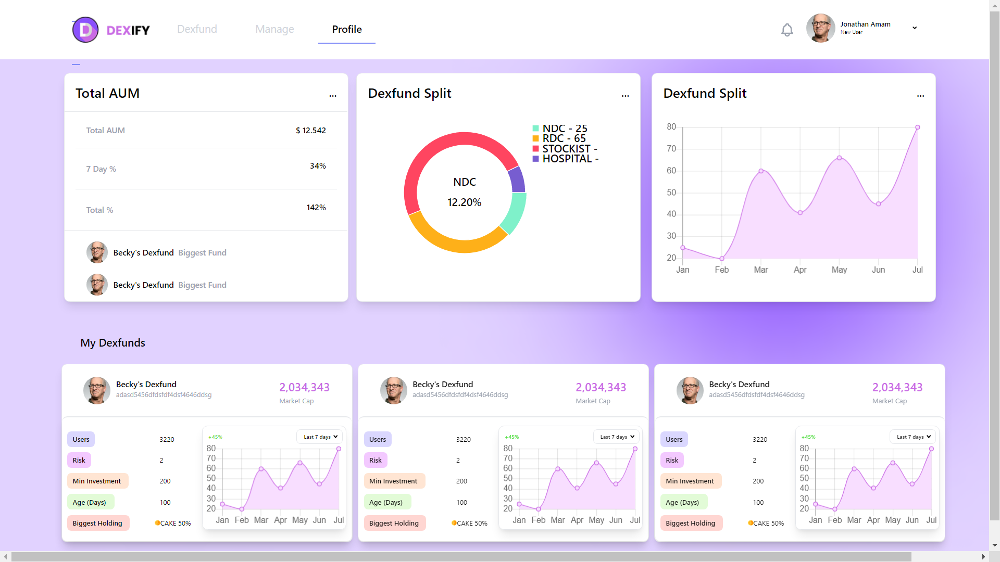
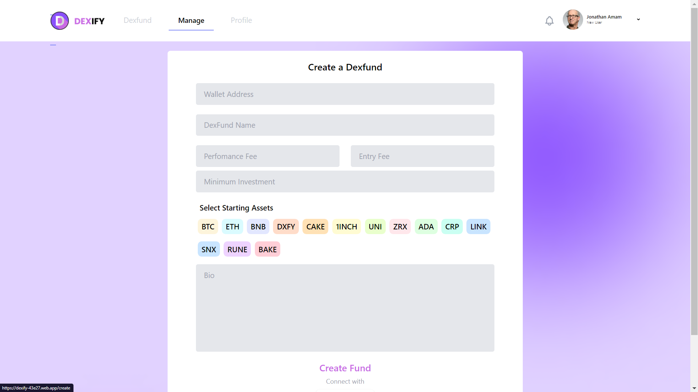

## 💬 Dexify

This project is a Front-End of a Crypto Market Place made using JavaScript, React.js, Tailwind CSS, and some Firebase services like Firebase hosting.

## 📝 What I have done in this project

- Build it by [`create-react-app`](https://github.com/facebook/create-react-app)
- Created different `components` for different functionalities like `HomePage`, `PersonalDashboard `, `header` and more..
- Used [`react-router-dom`](https://www.npmjs.com/package/react-router-dom) to navigate among various paths of the application
- Build clean **mobile friendly** user interface using [`Tailwind CSS`](https://tailwindcss.com/)
- Deployed it with [`Firebase Hosting`](https://firebase.google.com/docs/hosting)

## 🚀 Live Demo

Open [`https://dexify-43e27.web.app/`](https://dexify-43e27.web.app/) to view it in your **`mobile app`**.

## 🛠 Technologies Used

- JavaScript
- ReactJS
- HTML/CSS
- Firebase
- Tailwind CSS

## 📱 Project View





## 💻 Getting started

### Requirements

- [Node.js](https://nodejs.org/en/)
- [Yarn](https://classic.yarnpkg.com/) or [npm](https://www.npmjs.com/)

**Clone the project and access the folder**

```bash
$ git clone https://github.com/TAYYABAW/Dexify.git

$ cd Dexify
```

**Follow the steps below**

```bash
# Install the dependencies
$ yarn 
# or 
$ npm install

# Run the web app
$ yarn start 
# or 
$ npm start

```

## 🤔 How to contribute

**Follow the steps below**

```bash
# Clone your fork
$ git clone https://github.com/TAYYABAW/Dexify.git

$ cd Dexify

# Create a branch with your feature
$ git checkout -b your-feature

# Make the commit with your changes
$ git commit -m 'feat: Your new feature'

# Send the code to your remote branch
$ git push origin your-feature
```

After your pull request is merged, you can delete your branch

## 📝 License

This project is under the MIT license. See the [LICENSE](https://github.com/TAYYABAW/Dexify/blob/master/LICENSE) for more information.
